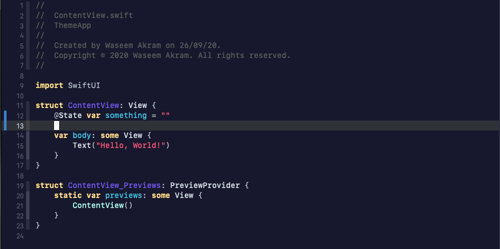

# 🎨 My Xcode theme - Rich Colors

This repository contains the Xcode theme that I use. Feel free to use it or modify it to your liking 👍




## Installation

1. Clone this repo:
```
$ https://github.com/devwaseem/XcodeTheme.git
```

2. Create a folder at this path if it doesn't exist already:
```
~/Library/Developer/Xcode/UserData/FontAndColorThemes
```

3. Copy the file `Rich.xccolortheme` into the above folder.

4. Open Xcode preferences ( or click ` ⌘ + , ` ) and select the `Rich` theme


